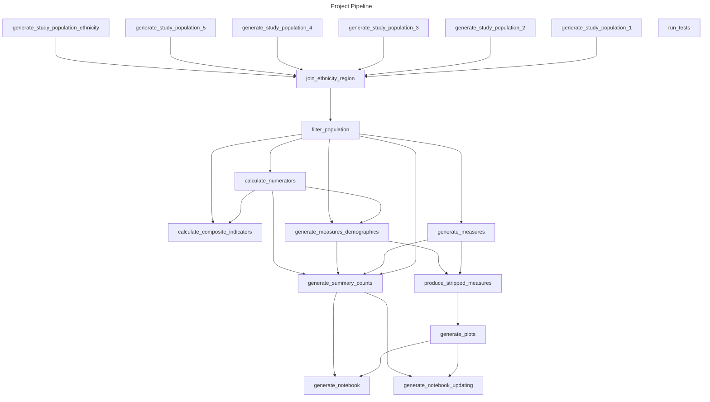

```mermaid
---
title: Project Pipeline
---
graph 
generate_study_population_1["generate_study_population_1"]
generate_study_population_2["generate_study_population_2"]
generate_study_population_3["generate_study_population_3"]
generate_study_population_4["generate_study_population_4"]
generate_study_population_5["generate_study_population_5"]
generate_study_population_ethnicity["generate_study_population_ethnicity"]
join_ethnicity_region["join_ethnicity_region"]
filter_population["filter_population"]
calculate_numerators["calculate_numerators"]
calculate_composite_indicators["calculate_composite_indicators"]
generate_measures["generate_measures"]
generate_measures_demographics["generate_measures_demographics"]
produce_stripped_measures["produce_stripped_measures"]
generate_summary_counts["generate_summary_counts"]
generate_plots["generate_plots"]
generate_notebook["generate_notebook"]
generate_notebook_updating["generate_notebook_updating"]
run_tests["run_tests"]
generate_study_population_1 ---> join_ethnicity_region
generate_study_population_2 ---> join_ethnicity_region
generate_study_population_3 ---> join_ethnicity_region
generate_study_population_4 ---> join_ethnicity_region
generate_study_population_5 ---> join_ethnicity_region
generate_study_population_ethnicity ---> join_ethnicity_region
join_ethnicity_region ---> filter_population
filter_population ---> calculate_numerators
calculate_numerators ---> calculate_composite_indicators
filter_population ---> calculate_composite_indicators
filter_population ---> generate_measures
calculate_numerators ---> generate_measures_demographics
filter_population ---> generate_measures_demographics
generate_measures ---> produce_stripped_measures
generate_measures_demographics ---> produce_stripped_measures
filter_population ---> generate_summary_counts
generate_measures ---> generate_summary_counts
generate_measures_demographics ---> generate_summary_counts
calculate_numerators ---> generate_summary_counts
produce_stripped_measures ---> generate_plots
generate_plots ---> generate_notebook
generate_summary_counts ---> generate_notebook
generate_plots ---> generate_notebook_updating
generate_summary_counts ---> generate_notebook_updating
```